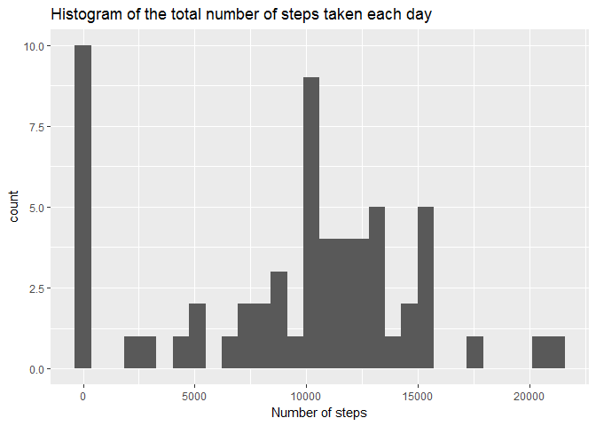
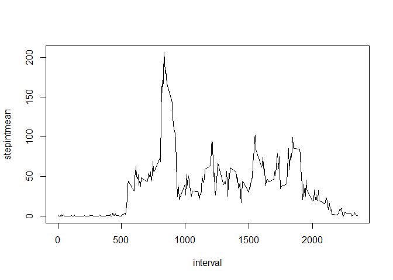
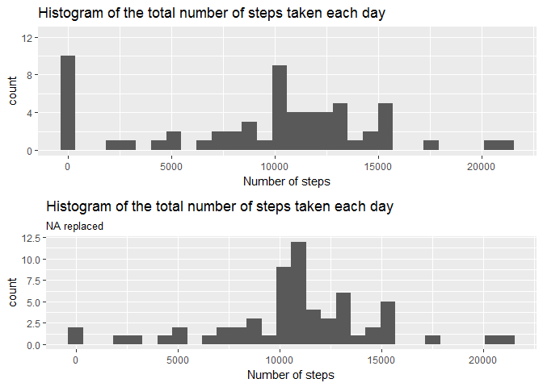
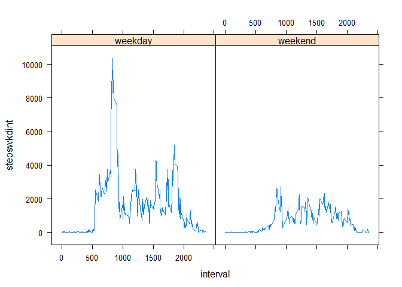

# Reproducible research - Week 2 Assignment
François de BELLEFON  
21 mai 2017  


#Loading and processing the data

We're reading the data from the csv file. It has a header and its NA values are "NA".

```r
act <- read.csv("activity.csv",header=TRUE,na.strings = "NA")
```

#What is mean total number of steps taken per day?

##Steps taken per day

Let's calculate the total number of steps taken per day :


```r
act_date <- act %>% group_by(date)

date_sum <- act_date %>% summarise(stepssum = sum(steps,na.rm=TRUE)) 


date_sum
```

```
## # A tibble: 61 × 2
##          date stepssum
##        <fctr>    <int>
## 1  2012-10-01        0
## 2  2012-10-02      126
## 3  2012-10-03    11352
## 4  2012-10-04    12116
## 5  2012-10-05    13294
## 6  2012-10-06    15420
## 7  2012-10-07    11015
## 8  2012-10-08        0
## 9  2012-10-09    12811
## 10 2012-10-10     9900
## # ... with 51 more rows
```
##Histogram
Let's draw the histogram of it :

```r
stepsHist <- ggplot(data=date_sum, aes(stepssum)) + geom_histogram() + xlab("Number of steps") + ggtitle("Histogram of the total number of steps taken each day")
stepsHist
```

```
## `stat_bin()` using `bins = 30`. Pick better value with `binwidth`.
```

<!-- -->

##Mean per day
Let's calculate the mean of the total number of steps taken per day :


```r
date_mean <- act_date %>% summarise(stepsmean = mean(steps,na.rm=TRUE)) 
date_mean
```

```
## # A tibble: 61 × 2
##          date stepsmean
##        <fctr>     <dbl>
## 1  2012-10-01       NaN
## 2  2012-10-02   0.43750
## 3  2012-10-03  39.41667
## 4  2012-10-04  42.06944
## 5  2012-10-05  46.15972
## 6  2012-10-06  53.54167
## 7  2012-10-07  38.24653
## 8  2012-10-08       NaN
## 9  2012-10-09  44.48264
## 10 2012-10-10  34.37500
## # ... with 51 more rows
```

##Median per day
Let's calculate the median of the total number of steps taken per day :

```r
date_median <- act_date %>% summarise(stepsmed = mean(steps,na.rm=TRUE)) 
date_median
```

```
## # A tibble: 61 × 2
##          date stepsmed
##        <fctr>    <dbl>
## 1  2012-10-01      NaN
## 2  2012-10-02  0.43750
## 3  2012-10-03 39.41667
## 4  2012-10-04 42.06944
## 5  2012-10-05 46.15972
## 6  2012-10-06 53.54167
## 7  2012-10-07 38.24653
## 8  2012-10-08      NaN
## 9  2012-10-09 44.48264
## 10 2012-10-10 34.37500
## # ... with 51 more rows
```

#Average daily activity pattern
##Time plot series
Let's plot a time series of the 5-minutes interval and the average number of steps taken, averaged across all days :

```r
act_int <- act %>% group_by(interval)
int_mean <- act_int %>% summarise(stepintmean = mean(steps, na.rm=TRUE))
plot(int_mean,type="l")
```

<!-- -->
##Maximum number of steps per interval
The 5-minute interval, on average across all the days in the dataset, containing the maximum number of steps is the following :


```r
int_mean[which.max(int_mean$stepintmean),]$interval
```

```
## [1] 835
```

#Imputing missing values

##Total number of missing values
Here is the total number of missing values in the dataset :

```r
sum(is.na(act$steps))
```

```
## [1] 2304
```

##Strategy to replace the missing values :
For each missing values, replace it by the mean for the corresponding 5 minutes interval that we calculated earlier.


##Implementing this strategy

```r
# Initialize this new dataset :
actWithoutNA <- act


for(i in 1:length(actWithoutNA$steps)){
  if(is.na(actWithoutNA$steps[i])){
    actWithoutNA$steps[i] <- int_mean$stepintmean[int_mean$interval == actWithoutNA$interval[i]]
  }
}
```

##Comparing results

###Histogram
Let's draw an histogram of the total number of steps per day.

For comparison purposes, we add the old histogram (with the NA values) next to it.

```r
act_nona_date <- actWithoutNA %>% group_by(date)

date_nonna_sum <- act_nona_date %>% summarise(stepsnonnasum = sum(steps,na.rm=TRUE)) 

stepsHistWithoutNA <- ggplot(data=date_nonna_sum, aes(stepsnonnasum)) + geom_histogram() + xlab("Number of steps") + ggtitle("Histogram of the total number of steps taken each day", subtitle = "NA replaced")

grid.arrange(stepsHist + ylim(0,12.5),stepsHistWithoutNA)
```

```
## `stat_bin()` using `bins = 30`. Pick better value with `binwidth`.
## `stat_bin()` using `bins = 30`. Pick better value with `binwidth`.
```

<!-- -->


###Mean of values
Let's calculate the mean of values with replaced NAs :

```r
date_nonna_mean <- act_nona_date %>% summarise(stepsmean = mean(steps,na.rm=TRUE)) 
date_nonna_mean
```

```
## # A tibble: 61 × 2
##          date stepsmean
##        <fctr>     <dbl>
## 1  2012-10-01  37.38260
## 2  2012-10-02   0.43750
## 3  2012-10-03  39.41667
## 4  2012-10-04  42.06944
## 5  2012-10-05  46.15972
## 6  2012-10-06  53.54167
## 7  2012-10-07  38.24653
## 8  2012-10-08  37.38260
## 9  2012-10-09  44.48264
## 10 2012-10-10  34.37500
## # ... with 51 more rows
```


```r
MergedMean <- merge(date_nonna_mean,date_mean,by="date")
```


### Median of the values :
Let's calculate the median of values with replaced NAs :

```r
date_nonna_median <- act_nona_date %>% summarise(stepsmed = median(steps,na.rm=TRUE))
```


As we can see, these values differ from the one calculated precedently.


#Differences in activity patterns between weekdays and weekends


Let's create a dataset indicating if a date is a weekday or weekend :

```r
actWithoutNAwkd <- actWithoutNA %>% mutate(wkd = weekdays(as.Date(date)))
actWithoutNAwkd$wkd[actWithoutNAwkd$wkd %in% c("Monday","Tuesday","Wednesday","Thursday","Friday")] <- "weekday"
actWithoutNAwkd$wkd[actWithoutNAwkd$wkd %in% c("Saturday","Sunday")] <- "weekend"
```

##Average number of steps taken per day, averaged across all week days and week end days

```r
actWithoutNAwkdgrp <- actWithoutNAwkd %>% group_by(wkd,interval) %>% summarise(stepswkdint = sum(steps,na.rm=TRUE))
actWithoutNAwkdgrp
```

```
## Source: local data frame [576 x 3]
## Groups: wkd [?]
## 
##        wkd interval stepswkdint
##      <chr>    <int>       <dbl>
## 1  weekday        0  101.301887
## 2  weekday        5   20.037736
## 3  weekday       10    7.792453
## 4  weekday       15    8.905660
## 5  weekday       20    4.452830
## 6  weekday       25   71.566038
## 7  weekday       30   31.169811
## 8  weekday       35   51.207547
## 9  weekday       40    0.000000
## 10 weekday       45   80.830189
## # ... with 566 more rows
```

```r
xyplot(stepswkdint~interval|wkd, data = actWithoutNAwkdgrp, type = "l")
```

<!-- -->
